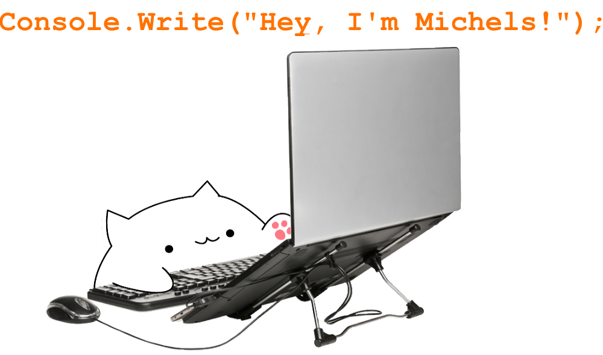

  

 

- 🌱 I’m currently learning **OOP with C#**
- 💡 I'm also learning **3D modeling** as a hobby 
- ✨ I’m looking to learn and collaborate on **open source projects**!
- 📫 You can reach me in **jvitormichels@gmail.com**

  <h3 align="left">Connect with me:</h3>
  
  

&nbsp;

<!--
**jvitormichels/jvitormichels** is a ✨ _special_ ✨ repository because its `README.md` (this file) appears on your GitHub profile.

Here are some ideas to get you started:

- 🔭 I’m currently working on ...
- 🌱 I’m currently learning OOP with C# ...
- 👯 I’m looking to collaborate on ...
- 🤔 I’m looking for help with ...
- 💬 Ask me about ...
- 📫 How to reach me: ...
- 😄 Pronouns: ...
- ⚡ Fun fact: ...
-->
